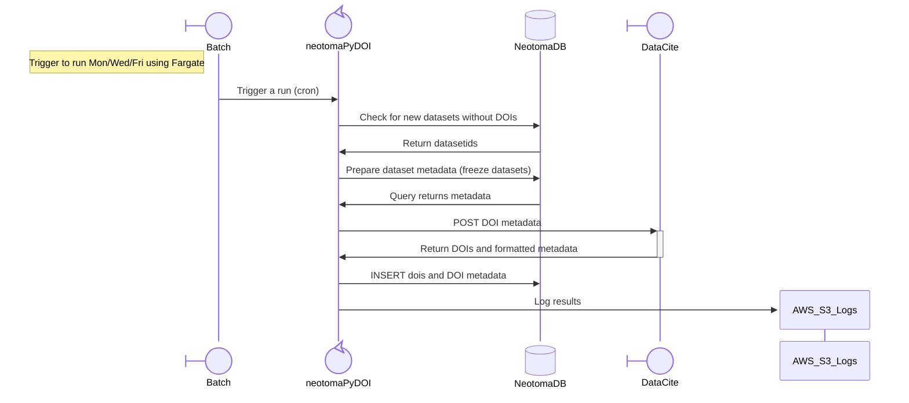

[](https://nsf.gov/awardsearch/showAward?AWD_ID=2410961)
[](https://www.bestpractices.dev/projects/11102)

# `neotomapydoi`: Minting and Managing Neotoma PIDs

## Note

**This project is only intended for Neotoma data administrators**.

Although general users can access the code, the system will not make "Neotoma" DOIs unless you have the proper authorization. It requires valid authorization for the [DataCite](https://datacite.org) system, as well as authorization for the production Neotoma database server. Without these you may be able to assemble DOI metadata from a database snapshot and examine or manipulate it yourself, but you will not be able to pull the most current Neotoma data, or mint data using the Neotoma DOI shoulder (`10.21233/`).

## Introduction

Neotoma stores information about tens of thousands of datasets around the world, including spatial, temporal and observational data about the taxa, chemistry and physical properties of the samples found in these sedimentary archives. These records are exposed through the Neotoma R package ([`neotoma2`](https::/github.com/NeotomaDB/neotoma2)), the [Neotoma API](https://api.neotomadb.org), [Neotoma Explorer](https://apps.neotomadb.org/explorer), and, more broadly, through their Digial Object identifiers (DOIs).

DOIs managed by DataCite have a [defined metadata schema](https://schema.datacite.org/), which allows Neotoma to provide dataset terms in a form that can be easily searched and returned by users around the globe, without the need for detailled knowledge about Neotoma or its database schema. The DOIs (e.g., [https://doi.org/10.21233/znex-sp94](https://doi.org/10.21233/znex-sp94)) return users to the Neotoma Landing Pages, where they can download records in JSON format and examine additional metadata about the records.



## Development

* [Simon Goring](http://goring.org): University of Wisconsin - Madison [](https://orcid.org/0000-0002-2700-4605)

* [Socorro Dominguez Vidana](https://ht-data.com/)[](https://orcid.org/0000-0002-7926-4935) 


## Contribution

We welcome user contributions to this project.  All contributors are expected to follow the [code of conduct](code_of_conduct.md). Contribution guidelines can be found in the [Contributing](CONTRIBUTING.md) document. Contributors should fork this project and make a pull request indicating the nature of the changes and the intended utility.  Further information for this workflow can be found on the GitHub [Pull Request Tutorial webpage](https://help.github.com/articles/about-pull-requests/).

## Using `neotomadoi`

### Requirements

* Python 3.12 in a Linux or MacOS environment.
* A valid connection to the Neotoma Paleoecology Database, either in the cloud (AWS) or locally (see the Neotoma Snapshot documentation)
* All packages as defined in the `pyproject.toml` file (use `uv` and the `uv install` command)
* Valid DataCite credentials

### Credential Storage

All credentials should be stored within a `.env` file. We provide [`.env-template`](.env-template) as an example. The user should modify this file to reflect their own credentials and connection strings for these environment variables.

```bash
DBAUTH={"host":"localhost","port":5432,"user":"postgres","password":"postgres","database":"neotoma"}
DCITE={"user": "USER","mode": {"test": {"handle": "10.00000","pw": "SANDBOX_PASSWORD"},"prod": {"handle": "10.00001","pw": "PRODUCTION_PASSWORD"}}}
DBAUTH_TEST={"host":"localhost","port":5432,"user":"postgres","password":"postgres","database":"neotoma_test"}
UV_PUBLISH_TOKEN="pypi-LONG_TEST_STRING"
```

## Minting DOIs

### Getting Help

```bash
uv run ndbdoi.py -h
```

The `ndbdoi.py` module uses `argparser` to manage commandline arguments. At any time you can get help by using the `-h` flag. With the help you can see there is one main function, `-m`, minting. However, there are times when we want to simply test that the minting process will run securely and send data to the DataCite Sandbox. In this case, we use the flag `-t` or `--tank`.

### Sandbox Minting

Before minting datasets, it is recommended to test the minting process using the Neotoma Holding Tank and the DataCite Sandbox:

```bash
uv run ndbdoi.py --tank
```

## Automated Minting

The manual Friday routine — a sandbox pass followed by a production mint — runs
itself on AWS, on Mondays, Wednesdays and Fridays. The `infrastructure/doi-minter.yaml` CloudFormation stack builds
out the architecture described in the sequence diagram above.

```
GitHub Actions (deploy.yml)          AWS
  build image ──────────────────────► ECR
  write credentials ────────────────► Secrets Manager
  deploy stack ─────────────────────► CloudFormation
                                        │
                                        ├─ EventBridge Scheduler ── cron(0 0 ? * MON,WED,FRI *)
                                        │        │
                                        │        ▼
                                        ├─ ECS Fargate task (private subnets)
                                        │        ├─► Neotoma RDS
                                        │        ├─► api.datacite.org
                                        │        ├─► CloudWatch Logs (stdout)
                                        │        └─► S3 (minting_*.log)
                                        │
                                        └─ EventBridge rule (non-zero exit) ─► SNS ─► email
```

The task runs **inside the VPC** because the Neotoma RDS instance sits on private
subnets and is not reachable from a GitHub-hosted runner. GitHub Actions builds
and deploys; EventBridge Scheduler and Fargate do the running.

`entrypoint.sh` performs the sandbox pass first and only continues to the
production mint if that pass exits cleanly.

> **The sandbox pass is not read-only.** Without the `-t` flag the script
> connects to the production database, and `freeze_data()` INSERTs rows into
> `doi.frozen`. It does *not* write `ndb.datasetdoi`, so no DOI is recorded —
> but "sandbox" here means "the DataCite sandbox", not "no writes". This is the
> same behaviour as a manual run.

### One-time setup

#### 1. The OIDC role

Create an IAM role — named `neotomapydoi` — that GitHub Actions in this
repository, and only this repository, can assume. Its name is never referenced
in code; the workflows find it through the `AWS_ROLE_ARN` repository secret.

Do not confuse it with the `neotoma-doi-minter-*` roles further down: those are
created by CloudFormation for the Fargate task and the scheduler to run as. The
`neotomapydoi` role is what GitHub assumes in order to *deploy* them.

If the account does not already have the GitHub OIDC provider, add it first:

```bash
aws iam create-open-id-connect-provider \
  --url https://token.actions.githubusercontent.com \
  --client-id-list sts.amazonaws.com
```

An OIDC role carries **two separate policies**, on two tabs in the IAM console:

* the **trust policy** ("Trust relationships") — *who may assume the role*. This
  is the one containing `Principal.Federated`.
* the **permissions policy** ("Permissions") — *what the role may then do*. This
  one never mentions OIDC.

If you create the role through the console, choose trusted entity type
**Web identity**, identity provider `token.actions.githubusercontent.com`,
audience `sts.amazonaws.com`, then fill in organisation `NeotomaDB` and
repository `neotomapydoi`. The console writes the trust policy for you and you
never type the block below — it is recorded here so the intended result can be
checked against **IAM → Roles → *role* → Trust relationships**.

Trust policy (console-generated):

```json
{
  "Version": "2012-10-17",
  "Statement": [{
    "Effect": "Allow",
    "Principal": {
      "Federated": "arn:aws:iam::<ACCOUNT_ID>:oidc-provider/token.actions.githubusercontent.com"
    },
    "Action": "sts:AssumeRoleWithWebIdentity",
    "Condition": {
      "StringEquals": {
        "token.actions.githubusercontent.com:aud": "sts.amazonaws.com"
      },
      "StringLike": {
        "token.actions.githubusercontent.com:sub": "repo:NeotomaDB/neotomapydoi:*"
      }
    }
  }]
}
```

Keep the `sub` condition narrow. A wildcard such as `repo:NeotomaDB/*` would let
any repository in the organisation assume a role that can read production
database credentials.

The permissions policy is the part you do have to write. Unlike a
deploy-to-S3 role, this one *provisions infrastructure*, so it is necessarily
broad — CloudFormation creates the roles, cluster, bucket, schedule and alarms
on its behalf. The pieces that can be scoped are scoped: the ECR repository, the
secret prefix, and the IAM role names.

```json
{
  "Version": "2012-10-17",
  "Statement": [
    {
      "Sid": "ECRPush",
      "Effect": "Allow",
      "Action": [
        "ecr:GetAuthorizationToken",
        "ecr:DescribeRepositories",
        "ecr:CreateRepository",
        "ecr:BatchCheckLayerAvailability",
        "ecr:InitiateLayerUpload",
        "ecr:UploadLayerPart",
        "ecr:CompleteLayerUpload",
        "ecr:PutImage",
        "ecr:BatchGetImage"
      ],
      "Resource": "*"
    },
    {
      "Sid": "MintingSecrets",
      "Effect": "Allow",
      "Action": [
        "secretsmanager:CreateSecret",
        "secretsmanager:DescribeSecret",
        "secretsmanager:PutSecretValue",
        "secretsmanager:TagResource"
      ],
      "Resource": "arn:aws:secretsmanager:us-east-2:<ACCOUNT_ID>:secret:neotoma/doi-minter/*"
    },
    {
      "Sid": "DeployStack",
      "Effect": "Allow",
      "Action": [
        "cloudformation:CreateStack",
        "cloudformation:UpdateStack",
        "cloudformation:DescribeStacks",
        "cloudformation:DescribeStackEvents",
        "cloudformation:DescribeStackResources",
        "cloudformation:GetTemplateSummary",
        "cloudformation:CreateChangeSet",
        "cloudformation:DescribeChangeSet",
        "cloudformation:ExecuteChangeSet",
        "cloudformation:DeleteChangeSet"
      ],
      "Resource": "arn:aws:cloudformation:us-east-2:<ACCOUNT_ID>:stack/neodoi-*/*"
    },
    {
      "Sid": "StackResources",
      "Effect": "Allow",
      "Action": [
        "ecs:CreateCluster",
        "ecs:DeleteCluster",
        "ecs:DescribeClusters",
        "ecs:RegisterTaskDefinition",
        "ecs:DeregisterTaskDefinition",
        "ecs:DescribeTaskDefinition",
        "ecs:TagResource",
        "ec2:CreateSecurityGroup",
        "ec2:DeleteSecurityGroup",
        "ec2:DescribeSecurityGroups",
        "ec2:AuthorizeSecurityGroupIngress",
        "ec2:AuthorizeSecurityGroupEgress",
        "ec2:RevokeSecurityGroupIngress",
        "ec2:RevokeSecurityGroupEgress",
        "ec2:DescribeVpcs",
        "ec2:DescribeSubnets",
        "ec2:CreateTags",
        "s3:CreateBucket",
        "s3:PutBucketPublicAccessBlock",
        "s3:PutBucketVersioning",
        "s3:PutBucketTagging",
        "s3:PutEncryptionConfiguration",
        "s3:PutLifecycleConfiguration",
        "s3:GetBucketLocation",
        "logs:CreateLogGroup",
        "logs:DeleteLogGroup",
        "logs:DescribeLogGroups",
        "logs:PutRetentionPolicy",
        "sns:CreateTopic",
        "sns:DeleteTopic",
        "sns:Subscribe",
        "sns:GetTopicAttributes",
        "sns:SetTopicAttributes",
        "scheduler:CreateSchedule",
        "scheduler:UpdateSchedule",
        "scheduler:GetSchedule",
        "scheduler:DeleteSchedule",
        "events:PutRule",
        "events:DeleteRule",
        "events:DescribeRule",
        "events:PutTargets",
        "events:RemoveTargets"
      ],
      "Resource": "*"
    },
    {
      "Sid": "StackIAMRoles",
      "Effect": "Allow",
      "Action": [
        "iam:CreateRole",
        "iam:DeleteRole",
        "iam:GetRole",
        "iam:PassRole",
        "iam:TagRole",
        "iam:AttachRolePolicy",
        "iam:DetachRolePolicy",
        "iam:PutRolePolicy",
        "iam:DeleteRolePolicy",
        "iam:GetRolePolicy",
        "iam:ListRolePolicies",
        "iam:ListAttachedRolePolicies"
      ],
      "Resource": "arn:aws:iam::<ACCOUNT_ID>:role/neotoma-doi-minter-*"
    },
    {
      "Sid": "RunMintingTask",
      "Effect": "Allow",
      "Action": ["ecs:RunTask", "ecs:DescribeTasks"],
      "Resource": "*"
    }
  ]
}
```

`StackIAMRoles` is the clause worth reading twice: it lets the deploy role
create IAM roles, which is only safe because the resource is pinned to the
`neotoma-doi-minter-*` name prefix that the template uses. Widening it to `*`
would let anything able to trigger this workflow create arbitrary roles.

If the `ecs:RunTask` permission on the deploy role feels too broad, it is only
needed by `run-minting.yml`; that workflow can be pointed at a second, much
narrower role instead.

#### 2. Repository secrets

| Secret | Value |
|---|---|
| `AWS_ROLE_ARN` | ARN of the role above |
| `RDS_HOSTNAME` | Neotoma RDS endpoint |
| `RDS_USERNAME` | database user |
| `RDS_PASSWORD` | database password |
| `DCITE` | the full DataCite JSON blob, verbatim from your local `.env` |
| `VPC_ID` | VPC containing RDS |
| `PRIVATE_SUBNETS` | comma-separated private subnet ids |
| `RDS_SECURITY_GROUP_ID` | security group attached to the RDS instance |
| `ALERT_EMAIL` | address notified when a run fails |

`DBAUTH` and `DBAUTH_TEST` are **not** secrets you set by hand. `deploy.yml`
assembles them from `RDS_HOSTNAME`, `RDS_USERNAME` and `RDS_PASSWORD` into the
psycopg2 keyword JSON that `neo_connect()` expects, then writes them to Secrets
Manager. The ECS task injects them as environment variables, which is why
`neo_connect()` reads `{**dotenv_values(), **os.environ}` rather than the `.env`
file alone.

#### 3. Confirm NAT egress

The task needs outbound HTTPS to DataCite, OpenAlex and ECR. Verify the private
subnets route through a NAT gateway:

```bash
aws ec2 describe-route-tables --region us-east-2 \
  --filters "Name=association.subnet-id,Values=<one-of-your-private-subnets>" \
  --query 'RouteTables[].Routes[?NatGatewayId!=`null`]'
```

If that returns nothing, either add a NAT gateway or switch the stack to the
public subnets with `AssignPublicIp: ENABLED`.

### Rollout order

Do not skip ahead to the production schedule.

1. **Deploy dev.** Push to `main`, or run **Deploy DOI Minter** with
   `environment: dev`. The dev stack points `DBAUTH` at `neotomatank`.
2. **Confirm the SNS subscription.** AWS emails a confirmation link to
   `ALERT_EMAIL`; the alert is inert until it is clicked.
3. **Run the gate.** **Run DOI Minting** → `environment: dev`,
   `mode: gate-only`. Check `/ecs/neotoma-doi-minter-dev` in CloudWatch for the
   `*** Neotoma DOI Generator ***` banner, and confirm logs land in
   `s3://neotoma-doi-logs-dev-<account>/`.
4. **Test the alarm.** Temporarily corrupt the `DCITE` secret, re-run, and
   confirm the task exits non-zero and the email arrives. An untested alert is
   not an alert.
5. **Deploy prod** with `environment: prod` and `schedule_enabled: DISABLED`.
6. **Run prod manually once** with `mode: full`, and compare the S3 logs against
   what a manual Friday run would have produced.
7. **Enable the schedule** by redeploying prod with `schedule_enabled: ENABLED`.

### Running on demand

**Run DOI Minting** (Actions tab) replaces the terminal session. Its `datasets`
input maps to `ndbdoi.py -d`, and `mode: gate-only` stops after the sandbox
pass. `-f/--force` is deliberately not exposed: force-publishing a dataset
submitted less than two days ago should stay a manual act from a workstation.

### Changing the schedule

The schedule is set literally in `infrastructure/doi-minter.yaml`, on the
`Schedule` resource:

```yaml
ScheduleExpression: cron(0 0 ? * MON,WED,FRI *)
ScheduleExpressionTimezone: America/Los_Angeles
```

Midnight Pacific on Mondays, Wednesdays and Fridays. Changing it means editing
the template and redeploying, which is deliberate — the schedule is reviewed
like any other change.

It is **not** a stack parameter, and that is worth understanding.
`aws cloudformation deploy` reuses the previous value of any parameter it is not
explicitly given, so a parameter's `Default` is only ever read when the stack is
first created. Editing a `Default` would appear to change the schedule while
leaving every existing stack untouched. Inlining the value removes that trap.

Running three times a week shortens how long a new dataset waits for its DOI,
while keeping the 48-hour window for records to settle. It does not mint
anything sooner than two days after creation — that floor comes from
`ds_timeslice.sql`, not the schedule. Runs with nothing to do report
`0 to process` and exit in a couple of seconds.

To stop a schedule without redeploying:

```bash
aws scheduler update-schedule --name neotoma-doi-minting-prod \
  --region us-east-2 --state DISABLED
```

## Neotoma DOI Metadata

The Neotoma API metadata can be seen on all Neotoma Landing Pages with minted DOIs.
